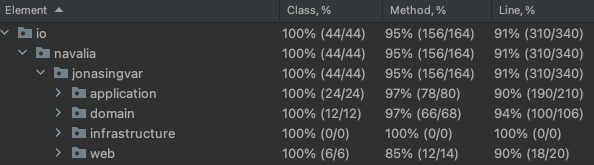

# Transactional Order API using Outbox Pattern 

## Objective

Build a REST API with a backing database that can accept an Order. Use the Outbox pattern to notify external
systems about the new order without dropping any messages in case the event system is down.

## Design Decisions

### Directory Layout

I split the directories into `application`, `domain` and `infrastructure` to align with DDD.

### Anti Corruption Layers

The Order DTO, database entity, and outgoing event are intentionally separated to prevent breaking changes from propagating across different layers, ensuring that each layer remains isolated and stable despite changes in others.

### Request Validation

I use Bean Validation annotations (@Min, @NotNull, etc.) for request validation to enforce data integrity and consistency.
I mapped different exceptions to correct HTTP response code (NotFoundException => 404 for example).

### Outbox Pattern

The order is first saved to the `ORDERS` and `PRODUCTS` tables. Then an event is created and stores as JSON in table `OUTBOX_EVENT`.
This is done as a transaction. A separate thread is then polling this table to send the request to a messaging system (using simple retries) and flipping the status to `Processed`.


## Unit and Integration Test



This runs all unit test + 
an end 2 end integration test that uses the API to submit an order
and retrieves the order through the API 

```bash
 ./gradlew clean test
```

### Run App

```bash
 ./gradlew bootRun
```


### Run manual script

```bash
 ./send_request.sh
```

Will print out this response
```json
{
  "id": "b2eb3512-f440-4ab9-8f13-f9a737c2712d",
  "products": [
    {
      "productKey": "BACKPACK-FR-14",
      "quantity": 2,
      "price": 149.99,
      "discount": 5,
      "name": "Fjallraven Backpack"
    },
    {
      "productKey": "HAT-FR-3",
      "quantity": 3,
      "price": 34.99,
      "discount": 0,
      "name": "Fjallraven Backpack"
    }
  ],
  "totalGross": 404.95,
  "totalNet": 394.95
}
```
```bash
 ./send_bad_request.sh
```

Will print out:
```json
{
  "products[1].price": "Must be great than 0",
  "products[1].quantity": "Must be great than 0",
  "products[1].productKey": "'productKey'' must be between 3 and 50 characters",
  "products[1].name": "'productKey'' must be between 3 and 500 characters",
  "products[1].discount": "Must be great than 0"
}
```


### H2 Database

This runs with an embedded H2 in-memory database. This could easily be changed to a postgres database or similar for
production.

Goto: http://localhost:8080/h2-console and enter URL: `jdbc:h2:mem:jonasingvar`


## Future Improvements

Because I tried to limit this to 4-5 hours, I had to skip a few things. 

- I used H2 for both tests and running the app (should have used postgres docker image for non-tests)
- I ran out of time when I was about to post the JSON event to Rabbit MQ (so it just prints the data to console)
- I didn't use @Async (because @Transactional doesn't work well with it) but should have used it for the simple `GET` endpoint
- I could have added more unit tests for the mappers (although they are all covered through the integration tests) 
- If I had more time I would have done docker-compose with `postgres` and `rabbitmq` and have a docker file for the app.
- Although code coverage is high, it could use a few more tests around some edge cases
- More logging
